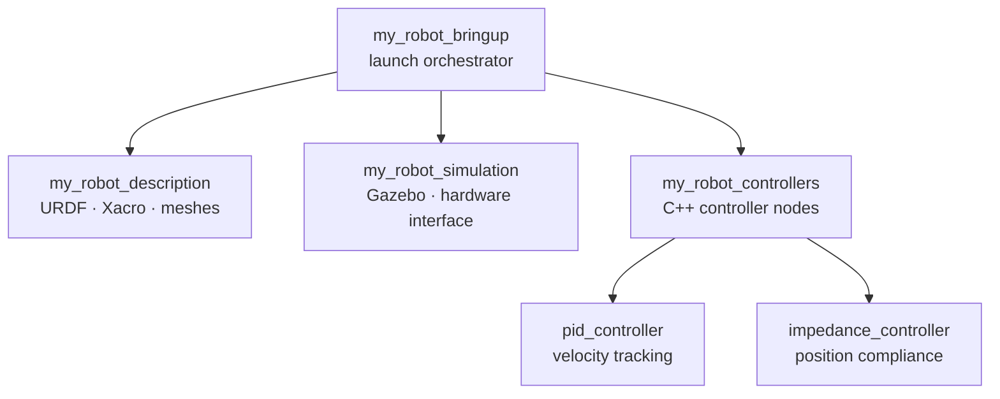
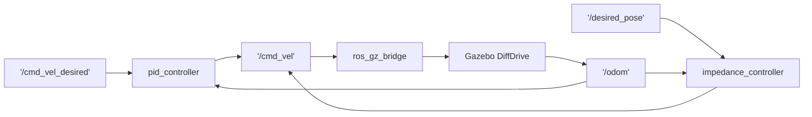

# ROS2 Differential Drive Robot with PID & Impedance Control

A complete ROS2 Jazzy robotics project implementing a differential drive
robot with custom PID and Impedance controllers, simulated in Gazebo Harmonic.

Built on Ubuntu 24.04 (WSL2) as a demonstration of the full ROS2 development
workflow — from URDF modelling to physics simulation and custom C++ controllers.

---

## Architecture


---

## Package Overview

### my_robot_description
- Xacro URDF defining a 2-wheeled differential drive robot
- Chassis, left/right drive wheels, passive caster wheel
- Gazebo diff drive plugin for physics simulation
- RViz2 display launch file

### my_robot_simulation
- Gazebo Harmonic integration
- ROS-Gazebo topic bridge (/cmd_vel, /odom, /clock)
- Robot spawning and world configuration

### my_robot_controllers
Two custom C++ controller nodes:

**PID Controller** (`pid_controller`)
- Subscribes to `/cmd_vel_desired` (target velocity)
- Reads actual velocity from `/odom`
- Computes P + I + D correction
- Publishes corrected velocity to `/cmd_vel`
- Tunable gains via ROS2 parameters at runtime

**Impedance Controller** (`impedance_controller`)
- Subscribes to `/desired_pose` (target position x, y, theta)
- Models robot as virtual mass-spring-damper system
- Implements: F = K*(x_d - x) - B*v
- Converts impedance force to velocity commands
- Dead zone prevents micro-corrections near goal

### my_robot_bringup
- Single-command launch of the full robot stack
- Timed sequence ensures correct startup order
- Configurable via launch arguments

---

## Requirements

| Component | Version |
|---|---|
| OS | Ubuntu 24.04 (native or WSL2) |
| ROS2 | Jazzy Jalisco |
| Gazebo | Harmonic 8.x |
| C++ | 17 |

---

## Installation

```bash
# 1. Create workspace
mkdir -p ~/ros2_ws/src
cd ~/ros2_ws/src

# 2. Clone repository
git clone https://github.com/YOUR_USERNAME/ros2-robot-controller.git .

# 3. Install dependencies
sudo apt install ros-jazzy-ros-gz \
                 ros-jazzy-diff-drive-controller \
                 ros-jazzy-joint-state-broadcaster \
                 ros-jazzy-topic-tools \
                 gz-harmonic -y

# 4. Build
cd ~/ros2_ws
colcon build
source install/setup.bash
```

---

## Usage

### Launch Full Stack (single command):
```bash
ros2 launch my_robot_bringup robot.launch.py
```

### Visualize Robot in RViz:
```bash
ros2 launch my_robot_description display.launch.py
```

### Run PID Controller:
```bash
# Terminal 1 — Simulation
ros2 launch my_robot_description gazebo.launch.py

# Terminal 2 — Controller
ros2 run my_robot_controllers pid_controller

# Terminal 3 — Send velocity command
ros2 topic pub /cmd_vel_desired geometry_msgs/msg/Twist \
  "{linear: {x: 0.5}, angular: {z: 0.0}}" --rate 10
```

### Run Impedance Controller:
```bash
# Terminal 1 — Simulation
ros2 launch my_robot_description gazebo.launch.py

# Terminal 2 — Controller
ros2 run my_robot_controllers impedance_controller

# Terminal 3 — Send goal position
ros2 topic pub /desired_pose geometry_msgs/msg/Pose2D \
  "{x: 2.0, y: 0.0, theta: 0.0}" --once
```

### Tune Controller Parameters at Runtime:
```bash
# PID gains
ros2 param set /pid_controller kp 1.5
ros2 param set /pid_controller ki 0.05
ros2 param set /pid_controller kd 0.1

# Impedance parameters
ros2 param set /impedance_controller k 2.0
ros2 param set /impedance_controller b 1.0
ros2 param set /impedance_controller m 0.2
```

---

## ROS2 Topic Graph


---

## Controller Theory

### PID Control
Controls velocity by correcting the error between desired and actual speed:
error     = desired_velocity - actual_velocity
P         = Kp × error
I         = Ki × ∫error dt
D         = Kd × d(error)/dt
output    = P + I + D

### Impedance Control
Models robot as a virtual mass-spring-damper system.
Controls position by computing virtual forces:

F = K × (x_desired - x_actual)   ← spring term

B × v_actual                  ← damping term
/ (M + 1)                       ← mass smoothing

Where:
K = stiffness  (how strongly robot returns to goal)
B = damping    (how smoothly it moves)
M = virtual mass (resistance to sudden changes)

---

## Project Structure

```
ros2_ws/src/
├── my_robot_bringup/
│   └── launch/
│       └── robot.launch.py
├── my_robot_description/
│   ├── urdf/
│   │   └── my_robot.urdf.xacro
│   ├── launch/
│   │   ├── display.launch.py
│   │   └── gazebo.launch.py
│   └── config/
│       └── ros2_control.yaml
├── my_robot_controllers/
│   ├── include/my_robot_controllers/
│   │   ├── pid_controller.hpp
│   │   └── impedance_controller.hpp
│   └── src/
│       ├── pid_controller.cpp
│       └── impedance_controller.cpp
└── my_robot_simulation/
```

---

## Known Limitations

- WSL2 environment limits message rate to ~1.5 Hz
  (native Linux achieves full 10+ Hz) Running ROS2 + Gazebo inside WSL2 on Windows limits
    the effective message publish rate to ~1.5 Hz instead
    of the expected 10+ Hz on native Linux. This is caused
    by WSL2's virtualisation overhead when handling shared
    memory transport (FastDDS). The controllers are correctly
    implemented and verified — this is purely an environment
    constraint. On native Ubuntu or a real robot, full rate
    is achieved.
- gz_ros2_control v1.2.17 bug with
  `use_sim_time` argument passing — using Gazebo's
  built-in diff drive plugin as workaround

---

## Highlights

This project demonstrates:
- ✅ ROS2 Jazzy (LTS) workspace setup and package management
- ✅ URDF/Xacro robot modelling with physics properties
- ✅ Gazebo Harmonic simulation integration
- ✅ Custom C++ controller nodes with rclcpp
- ✅ PID control theory implementation
- ✅ Impedance control theory implementation
- ✅ ROS2 topic pub/sub architecture
- ✅ Runtime parameter tuning via ROS2 params
- ✅ Launch file orchestration
- ✅ Git version control with meaningful commits